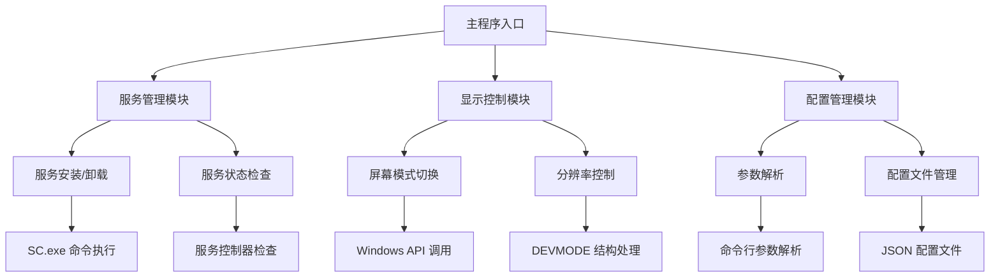
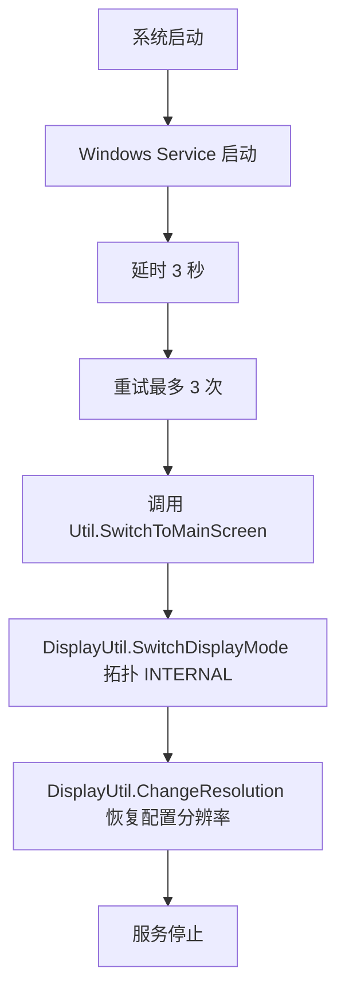

# 系统架构

## 整体架构

SunshineTool 采用 Windows 服务 + 交互式命令行的双模式架构，核心组件如下：

## 组件关系

- 入口与模式切换：[Program.cs](SunshineTool/Program.cs) 在交互模式下解析参数 [Util.ParseArgs()](SunshineTool/Util.cs:64)，在服务模式下通过 [ServiceBase.Run(new ScreenSwitchService())](SunshineTool/Program.cs:15) 启动服务。
- 服务管理模块：[ServiceHelper.cs](SunshineTool/ServiceHelper.cs) 提供 [ServiceHelper.IsServiceInstalled()](SunshineTool/ServiceHelper.cs:17)、[ServiceHelper.InstallService()](SunshineTool/ServiceHelper.cs:31)、[ServiceHelper.UninstallService()](SunshineTool/ServiceHelper.cs:52)。安装命令使用 SC.exe 创建服务，start=auto、type=own、obj=LocalSystem。
- Windows 服务类：[ScreenSwitchService](SunshineTool/ScreenSwitchService.cs) 在 [OnStart()](SunshineTool/ScreenSwitchService.cs:16) 中实现延时与重试并调用主屏切换。
- 显示控制模块：[DisplayUtil.SwitchDisplayMode()](SunshineTool/DisplayUtil.cs:45) 切换拓扑；[DisplayUtil.ChangeResolution()](SunshineTool/DisplayUtil.cs:71) 调整分辨率。
- 工具与配置：[Util.cs](SunshineTool/Util.cs) 提供 [Util.Do()](SunshineTool/Util.cs:139) 扩展模式流程、[Util.Undo()](SunshineTool/Util.cs:163) 主屏恢复流程、[Util.SwitchToMainScreen()](SunshineTool/Util.cs:58) 服务调用入口；配置类 [Cfg.cs](SunshineTool/Cfg.cs) 记录主屏默认分辨率与刷新率。

## 运行时数据流

- 服务模式：
  1. 系统启动后，服务由 SCM 以 LocalSystem 自动启动 [ServiceHelper.InstallService()](SunshineTool/ServiceHelper.cs:31)
  2. 服务执行 [ScreenSwitchService.OnStart()](SunshineTool/ScreenSwitchService.cs:16)
  3. 延时 3 秒，最多重试 3 次调用 [Util.SwitchToMainScreen()](SunshineTool/Util.cs:58)
  4. 主屏切换 [DisplayUtil.SwitchDisplayMode()](SunshineTool/DisplayUtil.cs:45) 使用拓扑 INTERNAL（type=0），随后 [DisplayUtil.ChangeResolution()](SunshineTool/DisplayUtil.cs:71) 恢复 [Cfg.MainWidth](SunshineTool/Cfg.cs:3)、[Cfg.MainHeight](SunshineTool/Cfg.cs:4)、[Cfg.MainFps](SunshineTool/Cfg.cs:5)
  5. 稍后服务调用 Stop 结束 [ScreenSwitchService.OnStop()](SunshineTool/ScreenSwitchService.cs:56)

- 交互式模式：
  1. 程序入口解析参数 [Util.ParseArgs()](SunshineTool/Util.cs:64) [Program.cs](SunshineTool/Program.cs:19)
  2. 当 [r=open](SunshineTool/Program.cs:41) 时执行 [Util.Do()](SunshineTool/Util.cs:139)：
     - 切换拓扑为外接屏或扩展模式（当前实现 type=3 为 EXTERNAL，扩展模式应为 type=2）[DisplayUtil.SwitchDisplayMode()](SunshineTool/DisplayUtil.cs:45)
     - 设定分辨率与刷新率：参数 [x,y,fps](SunshineTool/Util.cs:148) 或默认 1920x1080@60 [DisplayUtil.ChangeResolution()](SunshineTool/DisplayUtil.cs:71)
  3. 当 [r=close](SunshineTool/Program.cs:47) 时执行 [Util.Undo()](SunshineTool/Util.cs:163)：
     - 切换回主屏拓扑 INTERNAL（type=0）[DisplayUtil.SwitchDisplayMode()](SunshineTool/DisplayUtil.cs:45)
     - 恢复配置分辨率 [Cfg](SunshineTool/Cfg.cs)

## 服务启动流程（开机登录前切回主屏）

## 关键技术点

- Windows API：PInvoke [SetDisplayConfig](SunshineTool/DisplayUtil.cs:31)、[EnumDisplaySettings](SunshineTool/DisplayUtil.cs:35)、[ChangeDisplaySettings](SunshineTool/DisplayUtil.cs:37)
- 服务管理：SC.exe create/delete [ServiceHelper.InstallService()](SunshineTool/ServiceHelper.cs:31)、[ServiceHelper.UninstallService()](SunshineTool/ServiceHelper.cs:52)
- 配置持久化：启动时加载或初始化 cfg.json [Util.LoadConfig()](SunshineTool/Util.cs:24)，默认值来源于 [DisplayUtil.GetCurResolution()](SunshineTool/DisplayUtil.cs:117)

## 注意与改进点

- open 命令语义与实现：当前 [Util.Do()](SunshineTool/Util.cs:139) 使用 type=3 EXTERNAL，如需扩展模式应改为 type=2 EXTEND；请确认需求后在代码层调整。
- 日志行为：在 Release 服务模式下已启用文件日志 [Util.Log()](SunshineTool/Util.cs:193)。
- 启动依赖与登录阶段限制：登录前安全桌面阶段 [SetDisplayConfig](SunshineTool/DisplayUtil.cs:31) 返回 5（Access Denied），即使延时与重试也无法生效；此为系统限制，需在文档中明确。
- 关机触发方案：已尝试通过计划任务在关机事件触发 `r=close`，入口于 [ServiceHelper.InstallService()](SunshineTool/ServiceHelper.cs:31) 集成，但在目标环境下未能执行，当前“关机服务”不可用。
