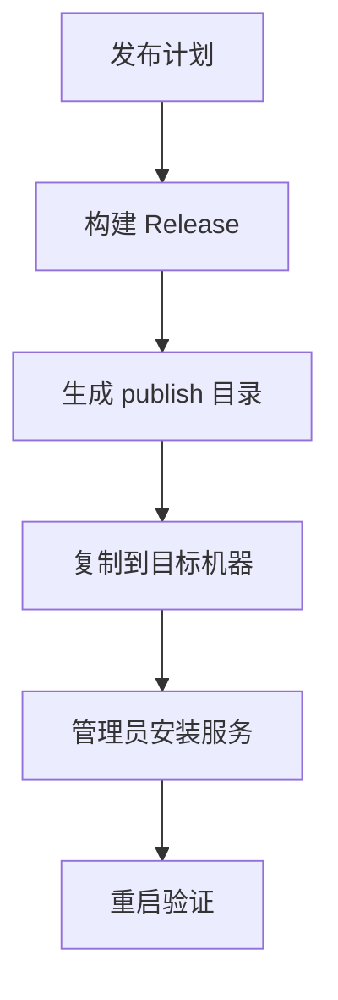
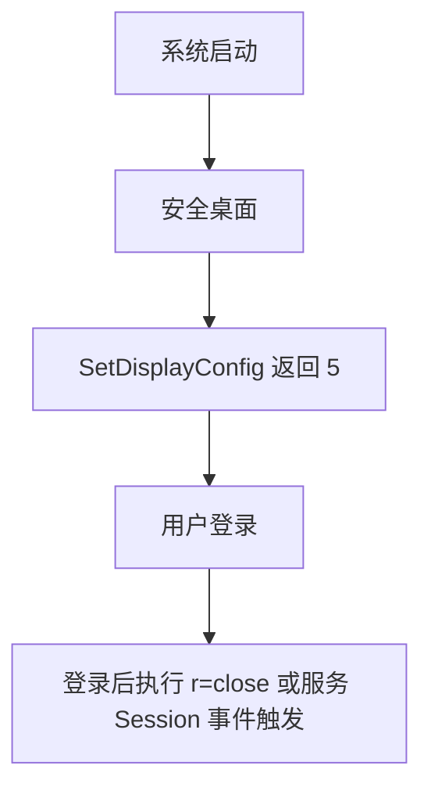

# 重复任务模板与工作流

## 修正 open 语义为 EXTEND
**最后执行日期**：2026-01-25

**需要修改的文件**：
- [Util.Do()](SunshineTool/Util.cs:139) — 将显示模式切换从 EXTERNAL 调整为 EXTEND
- [DisplayUtil.SwitchDisplayMode()](SunshineTool/DisplayUtil.cs:45) — 复核常量与拓扑映射，确保 type=2 为 EXTEND
- [Program.cs](SunshineTool/Program.cs) — 参数分支 [r=open](SunshineTool/Program.cs:41) 的路径检查

**步骤**：
1. 在 [Util.Do()](SunshineTool/Util.cs:143) 将 `DisplayUtil.SwitchDisplayMode(3)` 改为 `DisplayUtil.SwitchDisplayMode(2)`，使 open 对应 EXTEND。
2. 复核 [DisplayUtil.SwitchDisplayMode()](SunshineTool/DisplayUtil.cs:58) 中 type=2 的拓扑常量 `SDC_TOPOLOGY_EXTEND` 是否正确。
3. 检查入口 [Program.cs](SunshineTool/Program.cs:41) 的 `r=open` 分支是否只调用 [Util.Do()](SunshineTool/Util.cs:139)，无需其它变更。
4. 执行交互式验证：`SunshineTool.exe r=open x=1920 y=1080 fps=60`，确认进入扩展模式并设置分辨率。

**注意事项**：
- 若扩展模式失败，记录日志 [Util.Log()](SunshineTool/Util.cs:193)，并考虑加入失败后回退到主屏。
- 保持 [DisplayUtil.ChangeResolution()](SunshineTool/DisplayUtil.cs:71) 调用顺序在拓扑切换后。

---

## 服务启动策略调整
**目标**：确保开机登录前切回主屏稳定执行，并在必要时增加延迟启动或依赖显卡服务。

**涉及文件**：
- [ServiceHelper.InstallService()](SunshineTool/ServiceHelper.cs:31)
- [ScreenSwitchService.OnStart()](SunshineTool/ScreenSwitchService.cs:16)
- [Util.Log()](SunshineTool/Util.cs:193)

**步骤**：
1. 安装服务：保持 `sc.exe create` 参数为 `start= auto type= own obj= LocalSystem`，见 [ServiceHelper.InstallService()](SunshineTool/ServiceHelper.cs:31)。
2. 可选：需要延迟自启动时，执行 `sc.exe config SunshineToolService start= delayed-auto`。
3. 可选：需要依赖显卡驱动等服务时，执行 `sc.exe config SunshineToolService depend= Winmgmt` 或填入实际依赖。
4. 在 [ScreenSwitchService.OnStart()](SunshineTool/ScreenSwitchService.cs:16) 保持 `Task.Delay(3000)` 与最多 3 次重试逻辑，调用 [Util.SwitchToMainScreen()](SunshineTool/Util.cs:58)。
5. 强化日志：服务模式下建议写入文件日志，复核 [Util.Log()](SunshineTool/Util.cs:193) 的 `#if !DEBUG` 分支策略。

**注意事项**：
- Windows 延迟自动启动可能在部分环境下仍晚于图形栈就绪，需要结合重试与更长延时策略。

---

## 发布流程与命令
**目标**：生成自包含、单文件、压缩的可执行文件，部署并安装服务。

**涉及文件**：
- [SunshineTool.csproj](SunshineTool/SunshineTool.csproj)
- 发布命令注释位于 [Program.cs](SunshineTool/Program.cs:4)

**步骤**：
1. 复核项目属性：
   - [PublishSingleFile](SunshineTool/SunshineTool.csproj:8) = true
   - [PublishTrimmed](SunshineTool/SunshineTool.csproj:9) = true
   - [SelfContained](SunshineTool/SunshineTool.csproj:10) = true
   - [RuntimeIdentifiers](SunshineTool/SunshineTool.csproj:11) = win-x64;win-x86
   - [EnableCompressionInSingleFile](SunshineTool/SunshineTool.csproj:12) = true
2. 执行发布：`dotnet publish -c Release -r win-x64 --self-contained true -o ./publish`，参考 [Program.cs](SunshineTool/Program.cs:4)。
3. 部署：将 `./publish` 目录复制到目标路径，确保 `cfg.json` 可写。
4. 安装服务：以管理员运行 `SunshineTool.exe` 无参数，触发 [ServiceHelper.InstallService()](SunshineTool/ServiceHelper.cs:31)。
5. 验证：重启后检查服务是否在登录前执行主屏切换。

**示意**：

---

## 配置管理工作流
**目标**：明确 cfg.json 的生成、默认值来源与恢复逻辑。

**涉及文件**：
- [Cfg.cs](SunshineTool/Cfg.cs)
- [Util.AppDir](SunshineTool/Util.cs:19)
- [Util.LoadConfig()](SunshineTool/Util.cs:24)
- [DisplayUtil.GetCurResolution()](SunshineTool/DisplayUtil.cs:117)
- [Util.Undo()](SunshineTool/Util.cs:163)

**步骤**：
1. 首次运行时，在 [Util.AppDir](SunshineTool/Util.cs:19) 下生成 `cfg.json`，逻辑见 [Util.LoadConfig()](SunshineTool/Util.cs:24)。
2. 若无配置文件，初始化默认值：读取当前分辨率 [DisplayUtil.GetCurResolution()](SunshineTool/DisplayUtil.cs:117) 并写入 [Cfg.cs](SunshineTool/Cfg.cs)。
3. 切回主屏时，恢复分辨率与刷新率，路径在 [Util.Undo()](SunshineTool/Util.cs:172)。
4. 通过命令参数可覆盖临时分辨率 `x,y,fps`，解析见 [Util.ArgGetInt()](SunshineTool/Util.cs:105)。

**注意事项**：
- 保证应用目录拥有写权限；服务模式下建议将日志与配置路径置于可写位置。

---

## 新增显示模式支持
**目标**：在现有拓扑基础上扩展更多显示场景（如仅克隆、旋转、特定显示器选择）。

**涉及文件**：
- [DisplayUtil.SwitchDisplayMode()](SunshineTool/DisplayUtil.cs:45)
- [Program.cs](SunshineTool/Program.cs:41)
- [Util.ParseArgs()](SunshineTool/Util.cs:64)

**步骤**：
1. 在 [DisplayUtil.SwitchDisplayMode()](SunshineTool/DisplayUtil.cs:45) 增加模式分支或组合标志，并确保 `SetDisplayConfig` 调用的 `flags` 正确。
2. 在 [Program.cs](SunshineTool/Program.cs:41) 扩展 `r` 参数分支以接入新模式。
3. 在 [Util.ParseArgs()](SunshineTool/Util.cs:64) 增加相关参数解析，例如目标显示器 ID、方向等。
4. 编写测试命令并验证运行路径与日志输出。

**注意事项**：
- 某些显示组合可能需要高级 API 或更复杂的路径与模式数组；当前简化调用可能不覆盖所有场景。

---

## 登录前限制与替代策略（文档化，当前不实施）
**目标**：记录登录前无法执行主屏切换的边界与可选替代方案，当前仅文档化不实施。

**现状**：安全桌面阶段调用 [SetDisplayConfig](SunshineTool/DisplayUtil.cs:31) 返回 5（Access Denied），即使延时与重试也无法生效；入口路径为 [ScreenSwitchService.OnStart()](SunshineTool/ScreenSwitchService.cs:16) → [Util.SwitchToMainScreen()](SunshineTool/Util.cs:58) → [DisplayUtil.SwitchDisplayMode()](SunshineTool/DisplayUtil.cs:45)。

**涉及文件**：
- [ScreenSwitchService.OnStart()](SunshineTool/ScreenSwitchService.cs:16)
- [DisplayUtil.SwitchDisplayMode()](SunshineTool/DisplayUtil.cs:45)
- [Util.SwitchToMainScreen()](SunshineTool/Util.cs:58)
- [Util.Log()](SunshineTool/Util.cs:193)
- [ServiceHelper.InstallService()](SunshineTool/ServiceHelper.cs:31)

**替代方案（供未来考虑）**：
1. 登录后触发：服务中实现 OnSessionChange 以处理 SessionLogon/Unlock 并调用 [Util.SwitchToMainScreen()](SunshineTool/Util.cs:58)。
2. 登录计划任务：创建 Logon 触发的计划任务，执行 `SunshineTool.exe r=close`，并在 [Util.Log()](SunshineTool/Util.cs:193) 中记录执行日志。
3. 启动时机与依赖：根据需求配置 `delayed-auto` 或 `depend`，在 [ServiceHelper.InstallService()](SunshineTool/ServiceHelper.cs:31) 路径记录命令与结果。
4. 恢复分辨率：登录后若需恢复，启用 [DisplayUtil.ChangeResolution()](SunshineTool/DisplayUtil.cs:71)，确保 DEVMODE 的 dmFields 包含必要字段。

**注意事项**：
- Session 0 限制：安全桌面阶段的图形栈访问受限，预期返回 5。
- 日志策略：在 Release 服务模式下启用文件日志 [Util.Log()](SunshineTool/Util.cs:193)。

---

## 关机方案不可执行（文档化）
**目标**：记录已尝试的关机事件触发方案不可执行的现状与验证路径，当前仅文档化不实施。

**涉及文件**：
- 计划任务创建/删除逻辑：位于文件 [ServiceHelper.cs](SunshineTool/ServiceHelper.cs)
- 安装与卸载入口： [ServiceHelper.InstallService()](SunshineTool/ServiceHelper.cs:31)、[ServiceHelper.UninstallService()](SunshineTool/ServiceHelper.cs:52)
- 日志记录： [Util.Log()](SunshineTool/Util.cs:193)

**已尝试**：
- 事件触发：System 日志 USER32 事件 1074。
- 运行账户：SYSTEM，RunLevel 最高可用。
- 创建方式：schtasks /Create /XML，WorkingDirectory 指向部署路径。

**验证与观察**：
- 关机时无日志记录，登录后检查日志未见 `r=close` 执行痕迹。

**未来可评估的变体（不实施）**：
- 触发源变体：Logoff、Kernel-Power 等事件，但可靠性存疑。
- 运行账户与时机：考虑使用用户上下文的 Logoff 或注册表 RunOnce，但需权衡权限与时机。

**结论**：
- 在目标环境下关机阶段不可用，当前“关机服务”维持不可执行状态，仅保留文档化记录。
